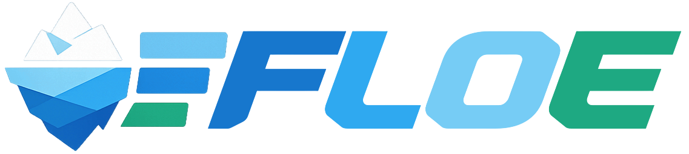

# Floe

Technical ingestion on a single node, driven by YAML contracts.

Floe is a Rust + Polars tool for technical ingestion on a single node. It ingests raw files into typed datasets using YAML contracts, applying schema enforcement and simple data quality rules with clear, auditable outputs.

## What Floe solves

- Schema enforcement and type casting (`strict` vs `coerce`)
- Nullability checks (`not_null`)
- Uniqueness checks (`unique`)
- Policy behavior: `warn` / `reject` / `abort`
- Accepted vs rejected outputs for clean separation
- JSON run reports for observability and audit

## Why Polars + Rust

- Polars provides fast, columnar execution on a single node without JVM overhead.
- Rust gives predictable performance and low-level control while keeping memory usage tight.
- The combo fits contract-driven ingestion: schema checks, deterministic outputs, and stable reports.
## Minimal config example

```yaml
version: "0.1"
report:
  path: "./reports"
entities:
  - name: "customer"
    source:
      format: "csv"
      path: "./example/in/customer"
    sink:
      accepted:
        format: "parquet"
        path: "./example/out/accepted/customer"
      rejected:
        format: "csv"
        path: "./example/out/rejected/customer"
    policy:
      severity: "reject"
    schema:
      columns:
        - name: "customer_id"
          type: "string"
          nullable: false
          unique: true
        - name: "created_at"
          type: "datetime"
          nullable: true
```

Full example: [example/config.yml](example/config.yml)

Config reference: [docs/config.md](docs/config.md)

## Quickstart (Homebrew)

### Install

```bash
brew tap malon64/floe
brew install floe
floe --version
```

### Validate

```bash
floe validate -c example/config.yml
```

### Run

```bash
floe run -c example/config.yml
```

### Troubleshooting

If Homebrew is unavailable:

- GitHub Releases: download the prebuilt binary from the latest release
- Cargo: `cargo install floe-cli`

More CLI details: [docs/cli.md](docs/cli.md)

## Sample console output

```text
run id: run-123
report base: ./reports
==> entity customer (severity=reject, format=csv)
  REJECTED customers.csv rows=10 accepted=8 rejected=2 elapsed_ms=12 accepted_out=customers.parquet rejected_out=customers_rejected.csv
Totals: files=1 rows=10 accepted=8 rejected=2
Overall: rejected (exit_code=0)
Run summary: ./reports/run_run-123/run.summary.json
```

## Outputs explained

- Accepted output: `entities[].sink.accepted.path`
- Rejected output: `entities[].sink.rejected.path`
- Reports: `<report.path>/run_<run_id>/<entity.name>/run.json`

Reports include per-entity JSON, a run summary, and key counters (rows, accepted/rejected, errors).

Report details: [docs/report.md](docs/report.md)

## Severity policy

- `warn`: keep all rows and report violations
- `reject`: reject only rows with violations; keep valid rows
- `abort`: reject the entire file on first violation

Checks and policy details: [docs/checks.md](docs/checks.md)

## Supported formats

Inputs:
- CSV (local and S3)
- Parquet (local and S3)
- NDJSON (local and S3)

Outputs:
- Accepted: Parquet, Delta
- Rejected: CSV

Sink details:
- Options: [docs/sinks/options.md](docs/sinks/options.md)
- Delta: [docs/sinks/delta.md](docs/sinks/delta.md)
- Iceberg: [docs/sinks/iceberg.md](docs/sinks/iceberg.md)

## Cloud integration and filesystems

Floe resolves all paths through a filesystem registry in the config. By default,
paths use `local://`. To use cloud storage, define a filesystem (with credentials
or bucket info) and reference it on `source`/`sink`. Currently only S3 is
implemented; Google Cloud Storage, Azure Data Lake Storage, and `dbfs://`
(Databricks) are on the roadmap.

Example (S3 filesystem):

```yaml
filesystems:
  default: local
  definitions:
    - name: local
      type: local
    - name: s3_raw
      type: s3
      bucket: my-bucket
      region: eu-west-1
      # credentials via standard AWS env vars or profile
entities:
  - name: customer
    source:
      filesystem: s3_raw
      path: raw/customer/
```

Filesystem guide: [docs/filesystems/s3.md](docs/filesystems/s3.md)

## Roadmap (near term)

- Cloud integration for storage and compute
- Python library release
- Orchestrator integrations (Airflow, Dagster)
- More input/output formats, including database sources and sinks
- Data platform integrations (Databricks, Microsoft Fabric, Snowflake)

Feature tracking: [docs/features.md](docs/features.md)

## License

MIT
