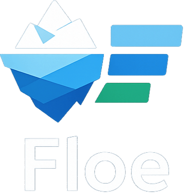

# Floe

Technical ingestion on a single node, driven by YAML contracts.

Floe is a Rust + Polars tool for technical ingestion on a single node. It ingests raw files into typed datasets using YAML contracts, applying schema enforcement and simple data quality rules with clear, auditable outputs.

## What Floe solves

- Schema enforcement and type casting (`strict` vs `coerce`)
- Nullability checks (`not_null`)
- Uniqueness checks (`unique`)
- Policy behavior: `warn` / `reject` / `abort`
- Accepted vs rejected outputs for clean separation
- JSON run reports for observability and audit

## Why not Spark?

- Floe targets single-node jobs where cluster setup and JVM overhead are unnecessary.
- It avoids distributed complexity for small/medium datasets.

## Why not Pandas?

- Better suited for larger-than-memory-ish CSV workloads via Polars.
- Stronger contract-driven ingestion and reporting model.

## Quickstart (Homebrew)

### Install

```bash
brew tap malon64/floe
brew install floe
floe --version
```

### Validate

```bash
floe validate -c example/config.yml
```

### Run

```bash
floe run -c example/config.yml
```

### Troubleshooting

If Homebrew is unavailable:

- GitHub Releases: download the prebuilt binary from the latest release
- Cargo: `cargo install floe-cli`

## Outputs explained

- Accepted output: `entities[].sink.accepted.path`
- Rejected output: `entities[].sink.rejected.path`
- Reports: `<report.path>/run_<run_id>/<entity.name>/run.json`

Reports include per-entity JSON, a run summary, and key counters (rows, accepted/rejected, errors).

## Minimal config example

```yaml
version: "0.1"
report:
  path: "./reports"
entities:
  - name: "customer"
    source:
      format: "csv"
      path: "./example/in/customer"
    sink:
      accepted:
        format: "parquet"
        path: "./example/out/accepted/customer"
      rejected:
        format: "csv"
        path: "./example/out/rejected/customer"
    policy:
      severity: "reject"
    schema:
      columns:
        - name: "customer_id"
          type: "string"
          nullable: false
          unique: true
        - name: "created_at"
          type: "datetime"
          nullable: true
```

Full example: `example/config.yml`

## Sample console output

```text
run id: run-123
report base: ./reports
==> entity customer (severity=reject, format=csv)
  REJECTED customers.csv rows=10 accepted=8 rejected=2 elapsed_ms=12 accepted_out=customers.parquet rejected_out=customers_rejected.csv
Totals: files=1 rows=10 accepted=8 rejected=2
Overall: rejected (exit_code=0)
Run summary: ./reports/run_run-123/run.summary.json
```

## Roadmap (near term)

- Parquet and JSON input formats
- Delta sink for accepted outputs
- S3 input/output stabilization
- Benchmarking harness and performance baselines
- Improved CLI UX and richer validation diagnostics

## License

MIT
