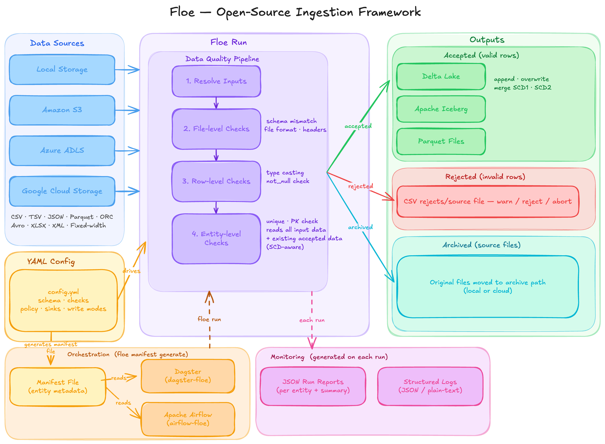

# Floe

**Floe** is a single-node, YAML-driven data ingestion framework written in Rust.  
You describe your data contract in a config file; Floe reads raw files, enforces your schema and quality rules, and writes clean accepted rows to your sink — routing invalid rows to a separate rejected output.

## Architecture



> Save the architecture diagram as `docs/assets/architecture.png` to render this image.

Each `floe run` executes a four-stage pipeline per entity:

| Stage | What happens |
|---|---|
| **1. Resolve inputs** | Discover and download source files from local or cloud storage |
| **2. File-level checks** | Validate schema structure, file format, and headers |
| **3. Row-level checks** | Apply type casting and `not_null` checks row by row |
| **4. Entity-level checks** | Apply `unique` / primary-key checks across all input rows plus existing accepted data (SCD-aware) |

Rows that pass all checks go to the **accepted** sink. Rows that fail go to the **rejected** sink. The severity policy (`warn` / `reject` / `abort`) controls how failures are handled. A JSON run report is written after every run.

## What Floe solves

- **Schema enforcement** — strict or coerce cast modes, column type checking
- **Data quality** — `not_null`, `unique`, primary-key checks
- **Clean separation** — accepted and rejected outputs in the same run
- **Incremental ingestion** — per-entity file-state tracking to skip unchanged files
- **Auditability** — per-entity and summary JSON reports on every run
- **Cloud-native paths** — S3, ADLS, GCS sources and sinks via a storage registry

## Minimal config example

```yaml
version: "0.3"
report:
  path: "./reports"
entities:
  - name: customer
    source:
      format: csv
      path: ./in/customer
    sink:
      accepted:
        format: parquet
        path: ./out/accepted/customer
      rejected:
        format: csv
        path: ./out/rejected/customer
    policy:
      severity: reject
    schema:
      columns:
        - name: customer_id
          type: string
          nullable: false
          unique: true
        - name: created_at
          type: datetime
          nullable: true
```

Full example: [example/config.yml](example/config.yml)  
Config reference: [docs/config.md](docs/config.md)  
Support matrix: [docs/support-matrix.md](docs/support-matrix.md)

## Quickstart

### Install (Homebrew)

```bash
brew tap malon64/floe
brew install floe
floe --version
```

Alternatives: download a prebuilt binary from [GitHub Releases](https://github.com/malon64/floe/releases) or `cargo install floe-cli`.

Full installation guide: [docs/installation.md](docs/installation.md)

### Validate a config

```bash
floe validate -c example/config.yml
```

### Run

```bash
floe run -c example/config.yml
```

### Run with an environment profile

Use a profile to inject environment-specific values (bucket names, paths, etc.) into `{{VAR}}` placeholders in your config without editing the config itself:

```yaml
# profiles/prod.yaml
apiVersion: floe/v1
kind: EnvironmentProfile
metadata:
  name: prod
variables:
  BUCKET: my-prod-bucket
  BASE_PATH: /data/prod
  # Cross-variable references are supported:
  OUT_PATH: ${BASE_PATH}/accepted
```

```bash
floe run -c config.yml --profile profiles/prod.yaml
```

Variable priority (highest wins): `env.vars` in config → `env.file` → profile variables.

### Run with Docker

```bash
docker pull ghcr.io/malon64/floe:latest
docker run --rm -v "$PWD:/work" ghcr.io/malon64/floe:latest run -c /work/example/config.yml
```

Cloud credentials are passed via environment variables, not baked into the image.

More CLI details: [docs/cli.md](docs/cli.md)

## Sample output

```text
run id: run-20240501-abc123
report base: ./reports
==> entity customer (severity=reject, format=csv)
  REJECTED customers.csv rows=10 accepted=8 rejected=2 elapsed_ms=12
Totals: files=1 rows=10 accepted=8 rejected=2
Overall: rejected (exit_code=0)
Run summary: ./reports/run_run-20240501-abc123/run.summary.json
```

## Severity policy

| Policy | Behaviour |
|---|---|
| `warn` | Keep all rows, surface violations in the report |
| `reject` | Route violating rows to rejected sink, keep valid rows |
| `abort` | Fail the entire entity on first violation |

Checks and policy details: [docs/checks.md](docs/checks.md)

## Incremental ingestion

Set `incremental_mode: file` on an entity to enable file-level state tracking. Floe records
processed file metadata and skips unchanged files on subsequent runs.

```bash
floe state inspect -c example/config.yml --entity customer
floe state reset   -c example/config.yml --entity customer --yes
```

## Supported formats

**Inputs** (local + S3 / ADLS / GCS):  
CSV · TSV · JSON (array/ndjson) · Parquet · ORC · Avro · XLSX · XML · Fixed-width

**Accepted outputs:**  
Parquet · Delta Lake (append, overwrite, merge SCD1/SCD2) · Apache Iceberg

**Rejected outputs:** CSV  
**Reports:** JSON

Sink details: [docs/sinks/options.md](docs/sinks/options.md) · [Delta](docs/sinks/delta.md) · [Iceberg](docs/sinks/iceberg.md)

## Cloud storage

Define a storage in your config and reference it on source/sink:

```yaml
storages:
  definitions:
    - name: s3_raw
      type: s3
      bucket: my-bucket
      region: eu-west-1
entities:
  - name: customer
    source:
      storage: s3_raw
      path: raw/customer/
```

Storage guides: [S3](docs/storages/s3.md) · [ADLS](docs/storages/adls.md) · [GCS](docs/storages/gcs.md)

## Orchestration

`floe manifest generate` produces a JSON manifest that orchestrators can read to schedule
entities as individual tasks:

```bash
floe manifest generate -c config.yml --output manifest.json
```

Connectors: [dagster-floe](https://github.com/malon64/dagster-floe) · [airflow-floe](https://github.com/malon64/airflow-floe)

## More docs

- [How it works](docs/how-it-works.md)
- [Checks reference](docs/checks.md)
- [Reports](docs/report.md)
- [Full summary](docs/summary.md)

## License

MIT
