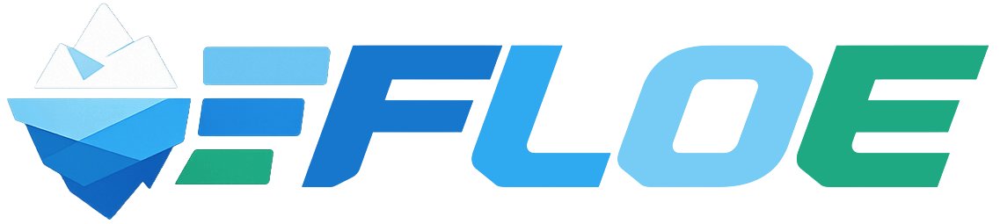
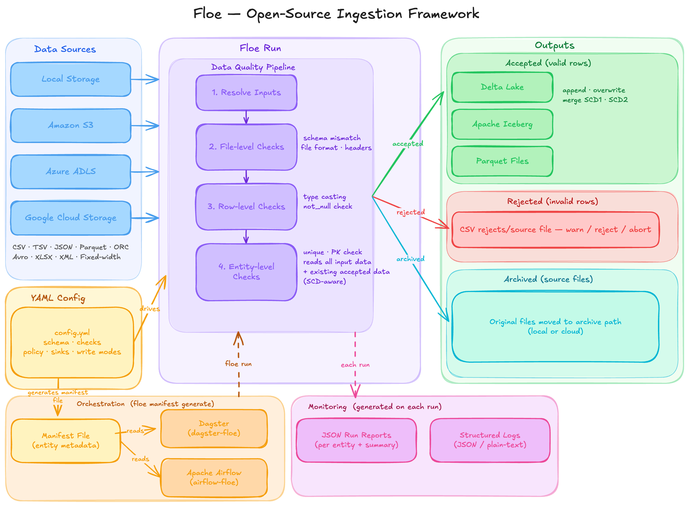

# Floe

**Floe** is a Polars-powered data contract runtime for reliable file ingestion.
It validates raw files or extracted datasets before they enter your trusted
layer, routing accepted rows to lakehouse sinks and rejected rows to quarantine
with audit reports.

Use Floe when you already have a platform such as Databricks, Fabric-style
lakehouses, Snowflake/Open Catalog, MotherDuck, Airflow, or Dagster, but you
need a lightweight entry gate for file contracts, quality checks, rejected rows,
and run evidence.

Floe complements extract/load tools such as dlt, ingestr, and Airbyte: they get
data out of source systems; Floe decides what is allowed into trusted storage.

## What Floe does

- Defines source, schema, checks, accepted output, rejected output, write mode,
  metadata, and reporting in one human-readable YAML contract.
- Reads common file exports and extracted datasets from local or cloud storage.
- Applies schema, casting, nullability, and uniqueness checks before write.
- Writes accepted rows to Parquet, Delta Lake, Apache Iceberg, or DuckDB.
- Writes invalid rows separately and emits deterministic JSON run reports.
- Runs as a CLI binary, Docker image, Python library, or orchestrated job.

## How it works



Each `floe run` executes a deterministic gate per entity:

| Stage | What happens |
|---|---|
| **1. Resolve inputs** | Discover and download source files from local or cloud storage |
| **2. File-level checks** | Validate schema structure, file format, and headers |
| **3. Row-level checks** | Apply type casting and `not_null` checks row by row |
| **4. Entity-level checks** | Apply `unique` / primary-key checks across all input rows plus existing accepted data |
| **5. Write outputs** | Route valid rows to accepted sinks, invalid rows to rejected sinks, and write reports |

Floe uses Rust, Polars, and Arrow for single-node columnar execution. At the
sink boundary, Arrow RecordBatches are handed to table-format writers without an
extra serialization hop.

- **Inputs:** CSV · TSV · JSON · Parquet · ORC · Avro · XLSX · XML · Fixed-width
- **Accepted outputs:** Parquet · Delta Lake · Apache Iceberg · DuckDB / MotherDuck
- **Storage:** local · S3 · ADLS · GCS
- **Catalogs:** AWS Glue · Iceberg REST (Polaris, Nessie, Snowflake) · Databricks Unity Catalog

## Feature index

| Capability | Start here |
|---|---|
| Contracts and full YAML reference | [docs/config.md](docs/config.md) |
| Pipeline phases and execution details | [docs/how-it-works.md](docs/how-it-works.md) |
| Checks: schema mismatch, cast, `not_null`, `unique` | [docs/checks.md](docs/checks.md) |
| Supported inputs, outputs, storage, and catalogs | [docs/support-matrix.md](docs/support-matrix.md) |
| Write modes: `overwrite`, `append`, `merge_scd1`, `merge_scd2` | [docs/write_modes.md](docs/write_modes.md) |
| Parquet, Delta, Iceberg, and DuckDB sinks | [docs/sinks/parquet.md](docs/sinks/parquet.md), [docs/sinks/delta.md](docs/sinks/delta.md), [docs/sinks/iceberg.md](docs/sinks/iceberg.md), [docs/sinks/duckdb.md](docs/sinks/duckdb.md) |
| S3, ADLS, and GCS storage | [docs/storages/s3.md](docs/storages/s3.md), [docs/storages/adls.md](docs/storages/adls.md), [docs/storages/gcs.md](docs/storages/gcs.md) |
| Incremental file state | [docs/incremental.md](docs/incremental.md) |
| Profiles and variables | [docs/profiles.md](docs/profiles.md), [docs/variables.md](docs/variables.md) |
| PII masking | [docs/pii.md](docs/pii.md) |
| Reports, logs, and OpenLineage | [docs/report.md](docs/report.md), [docs/logging.md](docs/logging.md), [docs/lineage.md](docs/lineage.md) |
| Airflow and Dagster manifests | [docs/manifest.md](docs/manifest.md), [orchestrators/airflow-floe/README.md](orchestrators/airflow-floe/README.md), [orchestrators/dagster-floe/README.md](orchestrators/dagster-floe/README.md) |
| Python and notebooks | [docs/python-bindings.md](docs/python-bindings.md) |
| Installation and CLI usage | [docs/installation.md](docs/installation.md), [docs/cli.md](docs/cli.md) |

## Install

**macOS / Linux — [Homebrew](https://brew.sh)**

```bash
brew tap malon64/floe
brew install floe
```

**Windows — [Scoop](https://scoop.sh)**

```bash
scoop bucket add floe https://github.com/malon64/scoop-floe
scoop install floe
```

**Docker**

```bash
docker pull ghcr.io/malon64/floe:latest
docker run --rm -v "$PWD:/work" ghcr.io/malon64/floe:latest run -c /work/config.yml
```

Or download a prebuilt binary from [GitHub Releases](https://github.com/malon64/floe/releases), or `cargo install floe-cli`.  
→ [Full installation guide](docs/installation.md)

**DuckDB sink** is shipped as a companion (the default artifacts are lean): use the
`ghcr.io/malon64/floe-duckdb` image, a `floe-duckdb` binary on your `PATH`, or the
off-PyPI `floe-duckdb` wheel. The lean `floe` auto-delegates DuckDB-sink runs to it.
→ [DuckDB support](docs/installation.md#duckdb-support-companion-distribution)

## Quick start

```bash
floe validate -c config.yml   # validate config and schema
floe run      -c config.yml   # run the pipeline
```

→ [Config reference](docs/config.md) · [Example config](example/config.yml)

For the full documentation entry point, see [docs/summary.md](docs/summary.md).

## License

MIT
